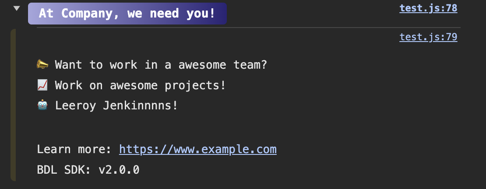

# Console Marketing Script



## Overview
This JavaScript code provides two main functionalities:
1. **DevTools Detection**: Detects if the browser's developer tools are open.
2. **Console Marketing**: Displays customized marketing messages in the browser console.

### Version
- SDK Version: 1.0.0

## Features

### DevTools Detection
- Detects whether the developer tools in the browser are open or closed.
- Uses the difference in window dimensions to infer the state of developer tools.
- Note: This method can be unreliable due to varying browser behaviors, monitor resolutions, and user configurations.

### Console Marketing
- Displays a branded, styled message in the browser console.
- Customizable properties include version, font size, background, color, padding, border radius, URL, SDK name, and the content of the message.
- Uses a self-executing function to initialize the SDK and prevent multiple initializations.

## Usage

### Detecting DevTools
Simply include the `detectDevTools` function in your script. It will set `devToolsOpen` to `true` or `false` based on the current state of the developer tools.

### Console Marketing
1. Create an instance of `consoleMarketing` with desired configurations.
2. Call the `init()` method on the created instance to display the message in the console.

Example:
```javascript
window.bdl.consoleMarketing = new consoleMarketing({
    version: '2.0.0',
    fontSize: 14,
    background: 'linear-gradient(90deg, hsla(184, 85%, 63%, 1) 0%, hsla(240, 46%, 76%, 1) 0%, hsla(245, 54%, 30%, 1) 100%);',
    color: 'white',
    padding: 4,
    borderRadius: 4,
    groupTitle: 'At Company we need you!'
});
window.bdl.consoleMarketing.init();
```

## Notes
- The script relies on global variables and may conflict with other scripts using the same variable names (e.g., `window.bdl`).
- The DevTools detection method is not guaranteed to work across all browsers and devices due to its reliance on window dimensions.
